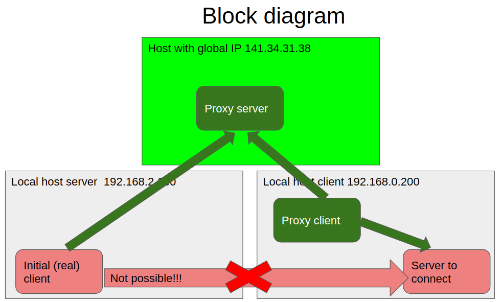

# proxy_pair  

  
  
The goal of this project is to prepare (provide) to binaries that will organize proxy functionality.
The use case of this can be when 2 hosts are in different local network and they should be connected.
For example in the case of remote debugging, if target host (where application to debug running) is in local
network and that local network is not the same with development host, then these binaries can be used to 
make target host visible for debugger host
